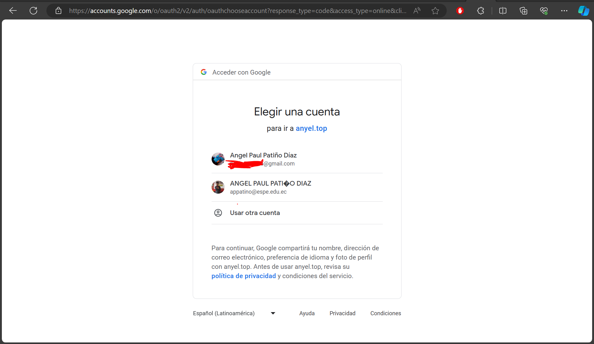
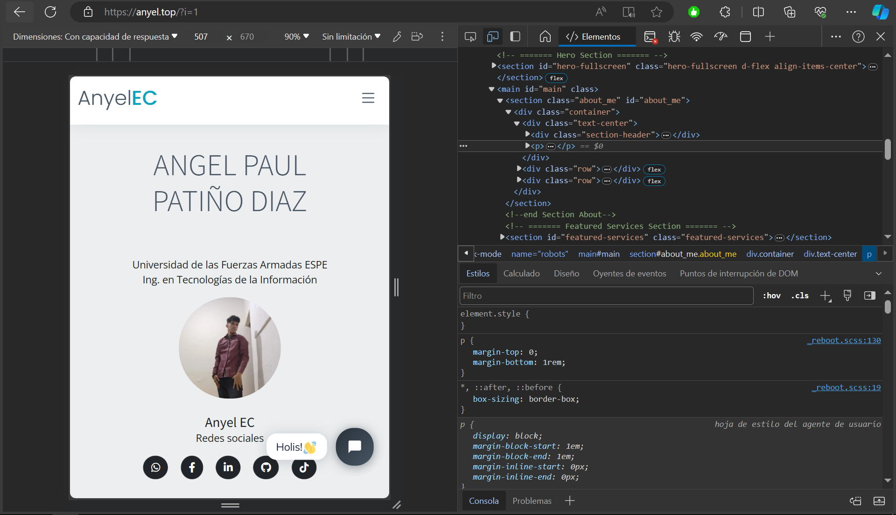
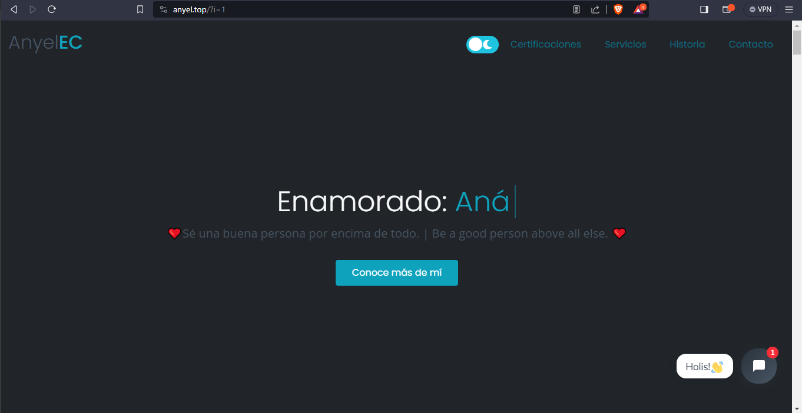
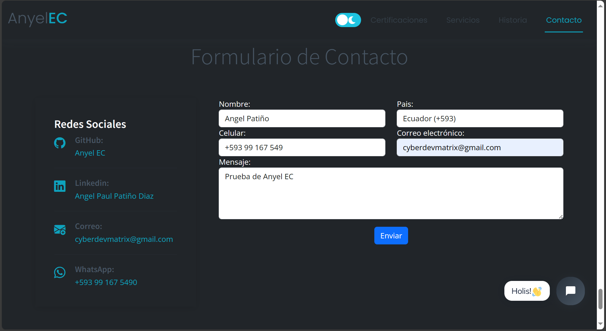
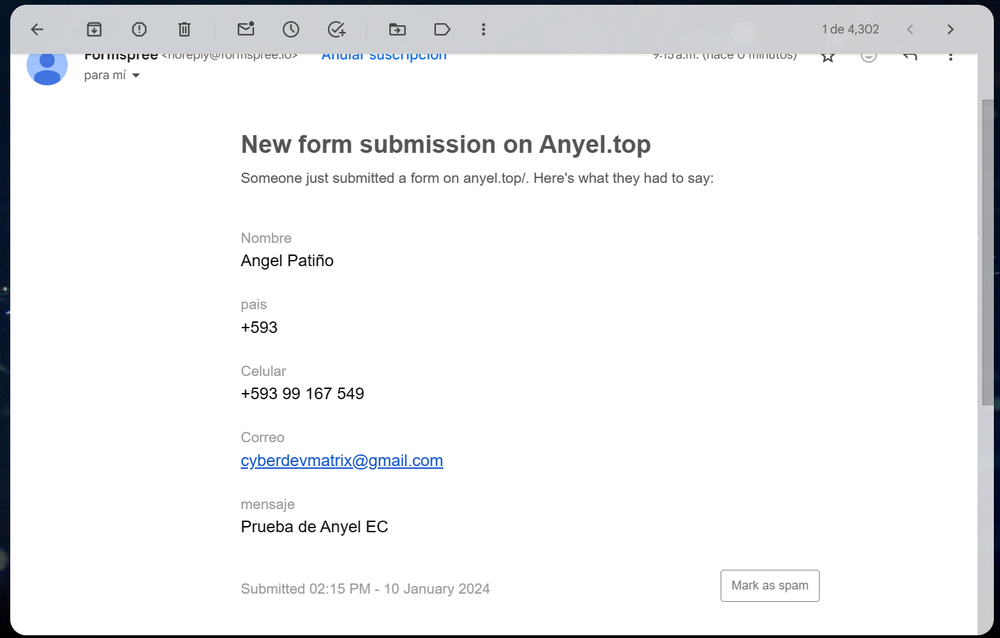

# Mi sitio web - www.anyel.top

¡Bienvenido a mi proyecto de sitio web personal! En este repositorio, encontrarás todos los archivos y recursos relacionados con mi sitio web alojado en www.anyel.top.

### Prerrequisitos
- Docker
- PHP 
- Compositor
- MongoDB
#### (En desarrollo, SIN TERMINAR)

### **Seleccionar Idioma:**
- [Español](README-es.md)
- [English](README.md)

## Result
### Google Auth
 
### OpenSSL Local
 
### Responsive Design
 
### Chat Bot (IA)
 
### Dark mode
 
### Light mode

### Form Contact

### Receipt of Email 

## Descripción del proyecto

Mi sitio web es un sitio personal creado usando HTML, CSS y JavaScript, haciendo uso del framework Bootstrap para el diseño y la experiencia de usuario. El proyecto incluye las siguientes características:

- Utilización de Bootstrap para un diseño responsivo y visualmente atractivo.
- Implementación de un archivo `.htaccess` con reglas de servidor para mejorar la seguridad y usabilidad del sitio.
- Uso de HTML, CSS y JavaScript para crear una experiencia web interactiva y atractiva.
- Integración de un formulario API para recopilar información de contacto.

## Acceso al sitio web

Mi sitio web está alojado en www.anyel.top. Puede visitarlo en su navegador web para experimentar la interfaz de usuario y saber más sobre mí y mi trabajo.

## Estructura del directorio

El repositorio está organizado de la siguiente manera:

- `index.html`: El archivo principal que representa la página de inicio del sitio.
- `css/`: Directorio que contiene los archivos CSS para dar estilo al sitio.
- `js/`: Directorio que contiene los archivos JavaScript utilizados para la funcionalidad interactiva.
- `.htaccess`: Fichero de configuración del servidor con reglas específicas.

## Cómo contribuir

Si deseas contribuir a este proyecto o hacer sugerencias, ¡eres bienvenido! Siéntete libre de hacer un fork del repositorio, hacer cambios y enviar un pull request. Estoy abierto a mejoras y nuevas ideas.

## Contacto

Si tienes alguna pregunta o comentario sobre este proyecto, por favor no dudes en ponerte en contacto conmigo a través de mi sitio web en www.anyel.top.

¡Gracias por visitar mi sitio web y revisar mi proyecto!

Traducción realizada con la versión gratuita del traductor DeepL.com
