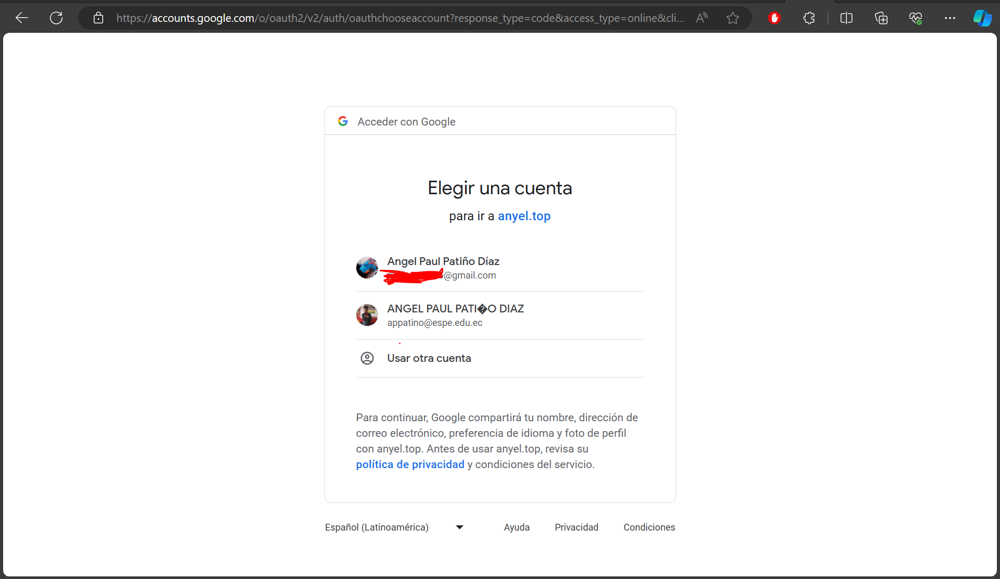
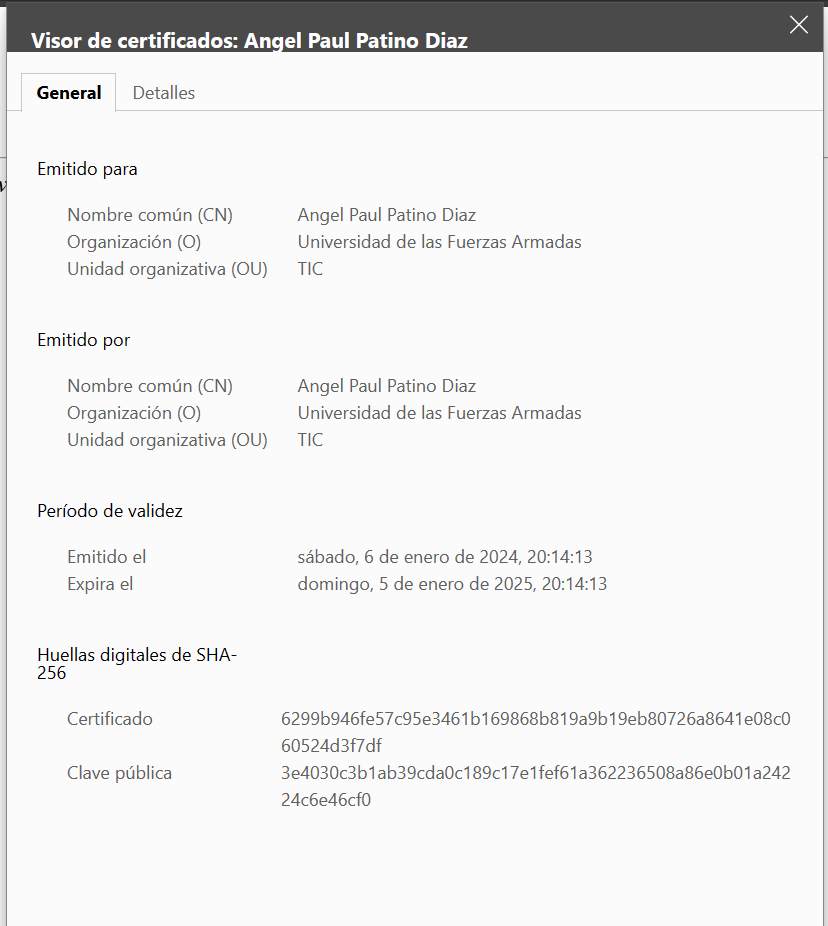
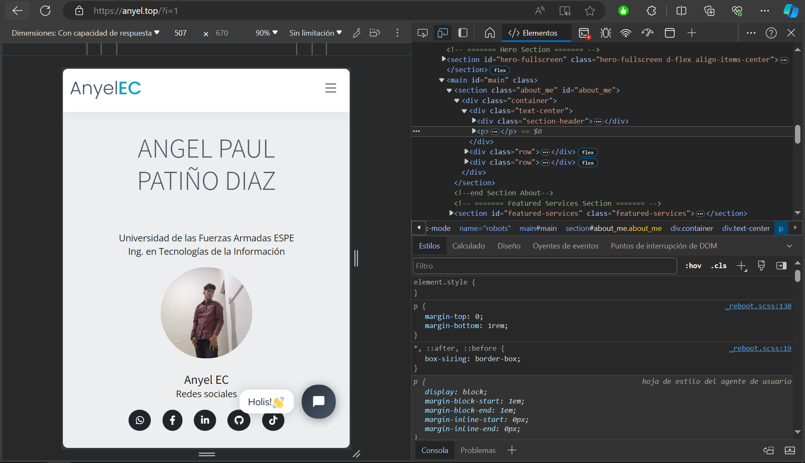
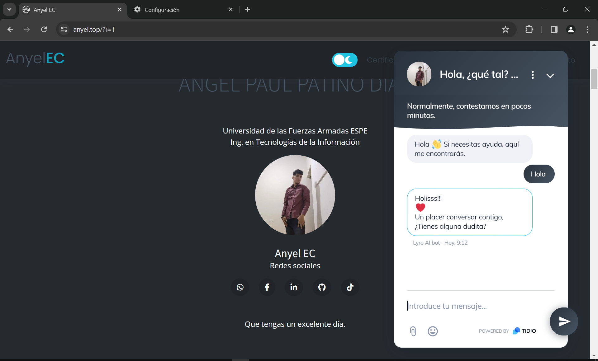
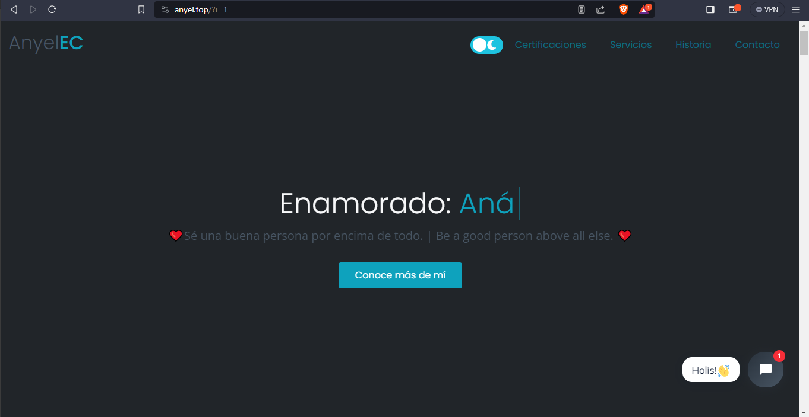
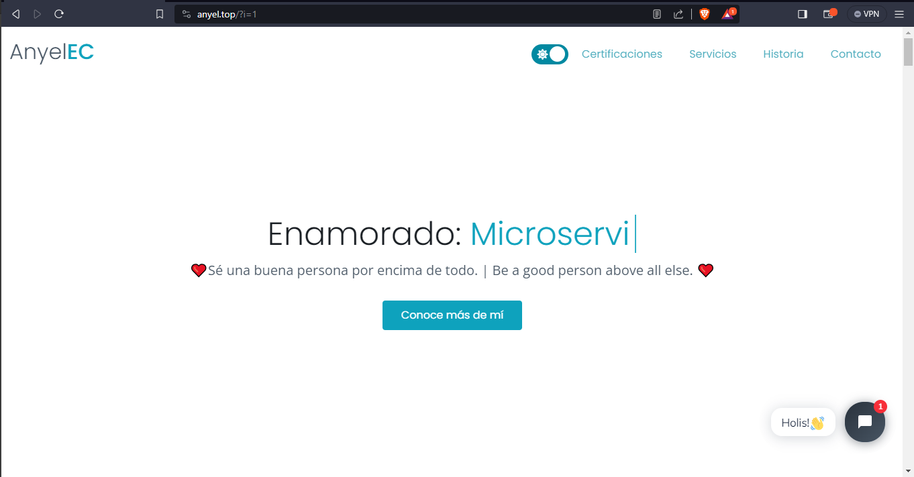
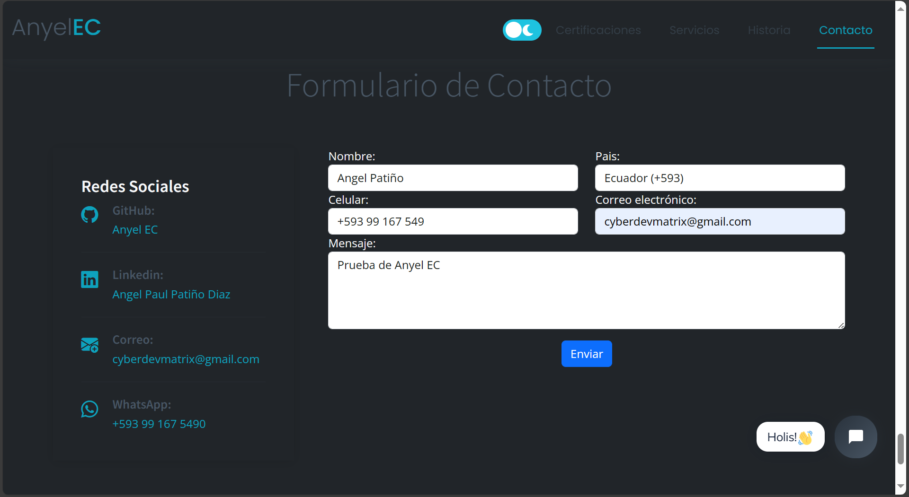
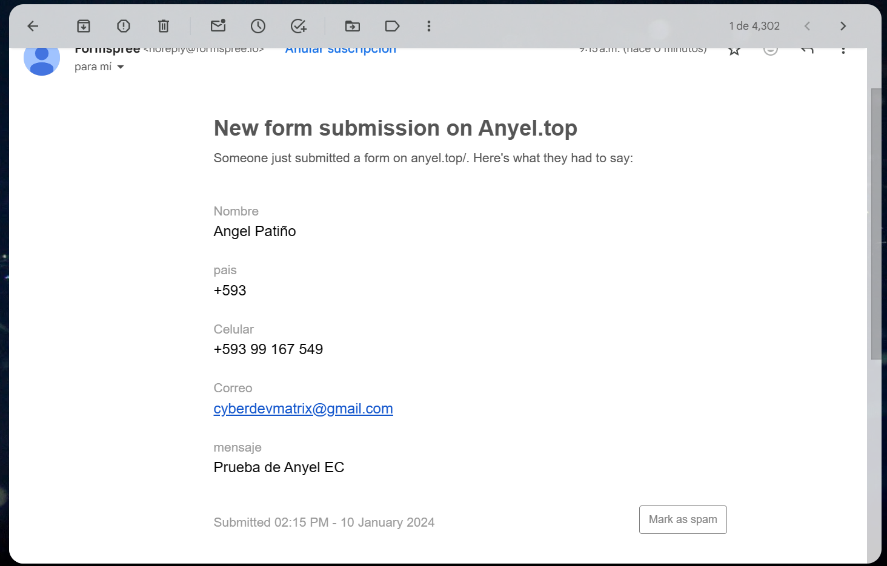

# My Website - www.anyel.top

Welcome to my personal website project! In this repository, you will find all the files and resources related to my website hosted at www.anyel.top.

### Prerequisites
- Docker
- PHP 
- Composer
- MongoDB
#### (In developement, NO FINISH)

### **Select Language:**
- [Español (Spanish)](README-es.md)
- [English](README.md)

## Result
### Google Auth
 
### OpenSSL Local
 
### Responsive Design
 
### Chat Bot (IA)
 
### Dark mode
 
### Light mode

### Form Contact

### Receipt of Email 

## Project Description

My website is a personal site created using HTML, CSS, and JavaScript, making use of the Bootstrap framework for design and user experience. The project includes the following features:

- Utilization of Bootstrap for responsive and visually appealing design.
- Implementation of an `.htaccess` file with server rules to enhance site security and usability.
- Use of HTML, CSS, and JavaScript to create an interactive and engaging web experience.
- Integration of a form API for collecting contact information.

## Accessing the Website

My website is hosted at www.anyel.top. You can visit it in your web browser to experience the user interface and learn more about me and my work.

## Directory Structure

The repository is organized as follows:

- `index.html`: The main file representing the site's homepage.
- `css/`: Directory containing CSS files for styling the site.
- `js/`: Directory containing JavaScript files used for interactive functionality.
- `.htaccess`: Server configuration file with specific rules.

## How to Contribute

If you wish to contribute to this project or make suggestions, you're welcome to do so! Feel free to fork the repository, make changes, and submit a pull request. I'm open to improvements and new ideas.

## Contact

If you have any questions or comments about this project, please don't hesitate to get in touch with me through my website at www.anyel.top.

Thank you for visiting my website and reviewing my project!
